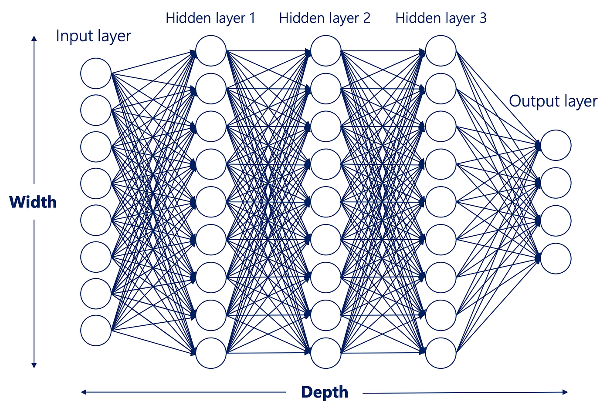

# 🧠 SimpleNN - Sentiment Analysis Sandbox (Learning Playground)

An educational, beginner-friendly sandbox designed to compare traditional Machine Learning and Deep Learning approaches for sentiment classification (Positive vs. Negative). 

This repository serves as a hands-on learning project to understand the core differences between TF-IDF vectorization with Naive Bayes, and word embeddings with Neural Networks.

---



---

## 📂 Project Structure

- **`sentiment_classifier_nb.py`**: A clean, single-file Python script implementing **Multinomial Naive Bayes** with **TF-IDF vectorization**.
- **`sentiment_classifier_nn.ipynb`**: A comprehensive Jupyter Notebook containing the training pipeline for a **TensorFlow Sequential Neural Network**.
- **`sentiment_model.keras`**: The pre-trained, production-ready Deep Learning model exported from Keras.
- **`tokenizer.json`**: The saved tokenizer configuration containing the word-to-index index mapping for text preprocessing.

---

## 🛠️ Approaches

### 1. Traditional Machine Learning (`sentiment_classifier_nb.py`)
- **Technology Stack**: `scikit-learn`, `numpy`
- **Methodology**: 
  - Uses **TF-IDF Vectorization** (Term Frequency-Inverse Document Frequency) to transform raw sentences into numerical matrices based on word relevance.
  - Implements a **Multinomial Naive Bayes (MultinomialNB)** classifier.
- **Key Feature**: Extremely fast training and evaluation times. Highly interpretable; allows inspection of class probabilities.

### 2. Deep Learning (`sentiment_classifier_nn.ipynb`)
- **Technology Stack**: `tensorflow`, `keras`, `numpy`
- **Architecture**:
  - **Embedding Layer**: Projects words into a 16-dimensional continuous vector space.
  - **Global Average Pooling 1D**: Flattens temporal sequence dimensions down to average representations.
  - **Dense Layer (ReLU)**: Extracts high-level non-linear features (16 neurons).
  - **Output Layer (Sigmoid)**: Outputs a continuous probability range between `0.0` (Highly Negative) and `1.0` (Highly Positive).
- **Key Feature**: Able to capture semantic meanings and word order sequences. Saves artifacts natively for easy integration into inference pipelines.

---

## 🚀 How to Run

### Prerequisites
Make sure you have Python installed and the required dependencies set up:
```bash
pip install tensorflow scikit-learn numpy jupyter
```

### Running the Naive Bayes Classifier
Run the standalone Python script directly from your terminal:
```bash
python sentiment_classifier_nb.py
```

### Running the Neural Network Pipeline
1. Open the notebook in VS Code (with the Jupyter extension installed) or launch Jupyter Notebook:
   ```bash
   jupyter notebook
   ```
2. Open and execute the cells inside **`sentiment_classifier_nn.ipynb`**.
3. The notebook will automatically train the model and save `sentiment_model.keras` and `tokenizer.json` locally upon completion.

---

## 📊 Dataset Preview
Both classifiers are trained on a curated corpus of **100 annotated reviews** (50 Positive / 50 Negative) representing real-world customer feedback variations:
- **Positive Example**: *"Exceeded my expectations in every way"*
- **Negative Example**: *"Broke within the first five minutes of use"*

---

## 🔮 Future Enhancements
- Expand the dataset to include multi-class emotions (Neutral, Angry, Excited).
- Integrate modern transformer models like **DistilBERT** for state-of-the-art accuracy.
- Build a lightweight web API using **FastAPI** to serve real-time inferences.
